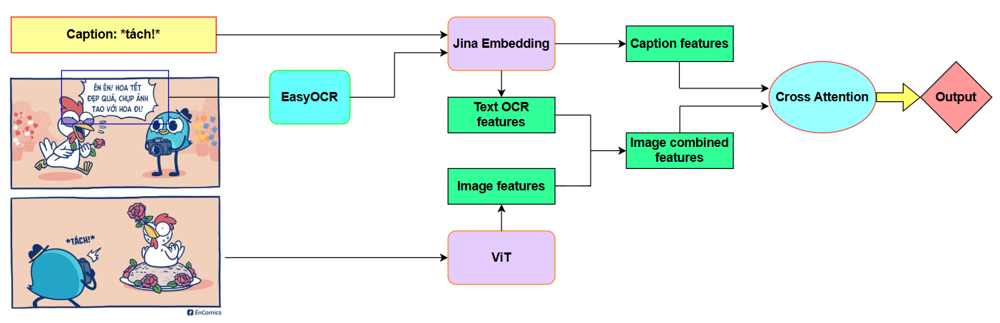

    <h1>Multimodal Sarcasm Detection</h1>

## **Introduction**

This repository aims to classify an image and its corresponding caption into one of four categories: not-sarcasm, image-sarcasm, text-sarcasm, or multi-sarcasm. To extract features, I use transformer-based architectures: ViT for image features and Jina for text features, along with EasyOCR to extract text appearing within the image. The complete pipeline is presented below: 

<a align="center">
    

## **Challenges**
* Effectively fusing different modalities to capture their interactions.
* Handling heavily imbalanced data distribution, as shown below.

<a align="center">
     

## **Solutions**
* Apply cross-attention to fuse text and image features effectively.
* Use Focal Loss to address the imbalanced data distribution.
